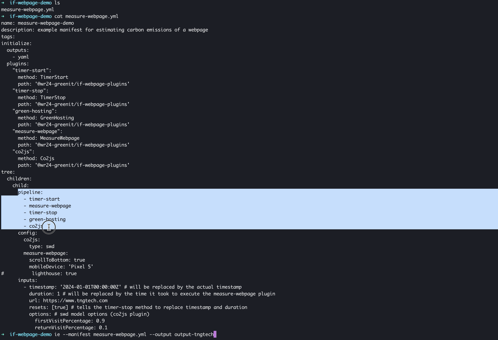

# Impact Framework - Plugins for Estimating Carbon Emissions of Webpages

## Introduction

<p align="center">
<a href="https://www.youtube.com/watch?v=oY9IxVzRbSw">

</a>
<br>
Click on the image to watch the demo video
</p>

With the plugins contained in this repo you can estimate the carbon emissions of a webpage. The plugins are designed to be used with the [Impact Framework](https://github.com/Green-Software-Foundation/if). You can assemble a pipeline with them that follows the same methodology as [websitecarbon.com](https://websitecarbon.com) or [ecograder.com](https://ecograder.com). See below for an example.

As the two aforementioned carbon estimation websites, the pipeline is using the [sustainable web design model](https://sustainablewebdesign.org/calculating-digital-emissions/) (swd) for carbon estimation. It is provided by the co2js plugin [1]. The swd model has a broad scope and includes all essential segments of the network into its estimation

- consumer device use
- network use
- data centre use
- hardware production

It makes the complexity of estimating the emissions of all this segments accessible by focusing on the number of transferred bytes on webpage load only. This number of bytes is multiplied by energy consumption per transferred byte. A metric that is estimated such that it includes the energy usage of entire system / internet. The estimated engery use is then multiplied by carbon intensity factor to get the carbon emissions attributed to the webpage load.

Of course, this approach sacrifices some accuracy for simplicity. For example the distance that the bytes travel through the network has no effect on the estimate but on the real emissions. Also, the amount of work that the data center has to do to process the requests, is not taken into account, just the size of the response that is finally sent. If you want to read up on the details of the swd model and the choices behind it, you can do so [here](https://sustainablewebdesign.org/calculating-digital-emissions/).

Compared to the mentioned carbon estimation websites, this pipeline has the advantage that you can choose all parameters that go into the estimation explicitly and make them transparent in your manifest file. The WebpageImpact plugin also makes an attempt to approximate the amount of data that is reloaded on revisit, thus taking into account the effectiveness of the caching layer explicitly - but there are some caveats. See the [plugin README](src/lib/webpage-impact/README.md) for more details.

[1] co2js plugin: For now this is a slightly modified version of the original plugin in [if-unofficial-plugins](https://github.com/Green-Software-Foundation/if-unofficial-plugins). But necessary changes are hopefully merged soon with this [PR](https://github.com/Green-Software-Foundation/if-unofficial-plugins/pull/50).

## Plugins

- Webpage Impact
- Green Hosting Check

The Webpage Impact plugin can measure the page weight of a webpage. It can also estimate the `dataReloadRatio` needed for the [Sustainable Webdesign Model](https://sustainablewebdesign.org/calculating-digital-emissions/) provided by the co2js plugin.

The Green Hosting Check plugin can check if a website is hosted green by querying the [database of the Green Web Foundation](https://www.thegreenwebfoundation.org/tools/green-web-dataset/).

For further info on the plugins, see their README files.

## Installation

For usage with the Impact Framework cli install globally with

```sh
npm install -g @tngtech/if-webpage-plugins
```

Puppeteer also requires access to a Chrome installation. If none is available,
install it with `npx puppeteer browsers install chrome`.

## Example Usage (manifest file)

Also see `example-manifests` directory.

Note: This manifest was tested with v0.7.1 of the Impact Framework (IF). Since IF's interface is still subject to change, it cannot be guaranteed that this manifest and the plugins will work with future versions of IF.

```yaml
name: webpage-impact-demo
description: example manifest for estimating carbon emissions of a webpage
tags:
initialize:
  outputs:
    - yaml
  plugins:
    'green-hosting':
      method: GreenHosting
      path: '@tngtech/if-webpage-plugins'
    'webpage-impact':
      method: WebpageImpact
      path: '@tngtech/if-webpage-plugins'
      config:
        scrollToBottom: false
        url: https://www.tngtech.com/
    'co2js':
      method: Co2js
      path: '@tngtech/if-webpage-plugins'
      config:
        type: swd
        version: 4
tree:
  children:
    child:
      pipeline:
        observe:
          - webpage-impact
          - green-hosting
        compute:
          - co2js
      inputs:
        - options: # for co2js plugin: swd model options
            firstVisitPercentage: 0.9
            returnVisitPercentage: 0.1
```

## License

`if-webpage-plugins` is published under the Apache License 2.0. For more information concerning the license, see [Apache License 2.0](https://www.apache.org/licenses/LICENSE-2.0).
